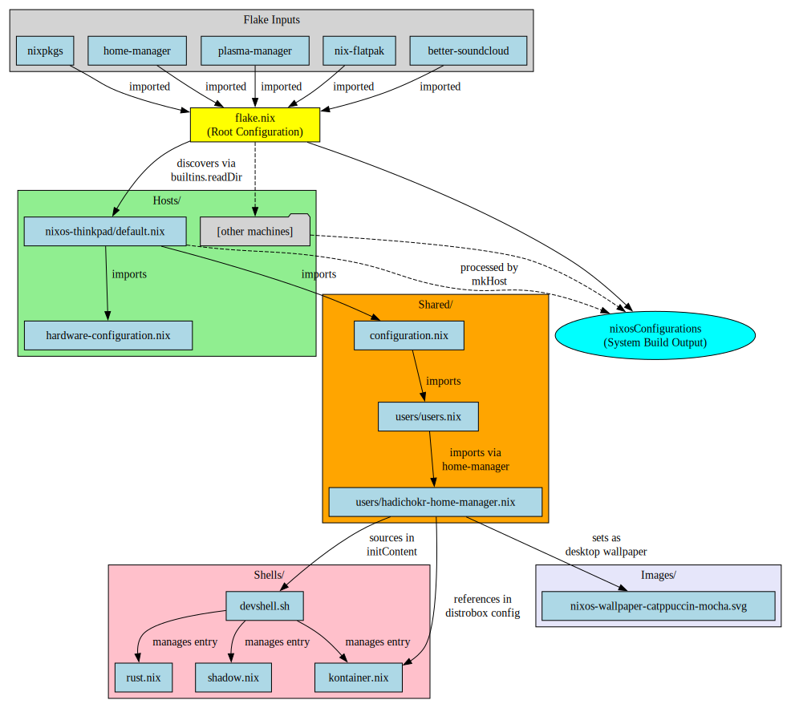

# ❄️ NixOS Flake Desktop Configuration

One desktop configuration, multiple machines. Each machine is a folder under `hosts/` with only hardware-specific differences.

## File Dependencies

```
flake.nix
├── Imports: nixpkgs, home-manager, plasma-manager, nix-flatpak, better-soundcloud
└── Discovers: hosts/ directory
    └── hosts/nixos-thinkpad/default.nix
        ├── imports: hardware-configuration.nix
        └── imports: shared/configuration.nix
            └── imports: shared/users/users.nix
                └── imports: hadichokr-home-manager.nix
                    ├── sources: shells/devshell.sh
                    ├── references: shells/kontainer.nix
                    └── uses: images/wallpaper.svg
```

<details>
<summary>📊 Visual Dependency Graph (Click to expand)</summary>



</details>

## Quick Start

### New Machine
1. Install NixOS normally
2. Move hardware config:
   ```bash
   mv /etc/nixos/hardware-configuration.nix /etc/nixos/hosts/<hostname>/
   ```
3. Create `hosts/<hostname>/default.nix`:
   ```nix
   { ... }:
   {
     imports = [
       ./hardware-configuration.nix
       ../../shared/configuration.nix
     ];
   }
   ```
4. Build:
   ```bash
   run0 nixos-rebuild switch --flake /etc/nixos#<hostname>
   ```

## Key Commands

```bash
rebuild           # Rebuild current host
update            # Update inputs and rebuild
list-hosts        # Show available machines
devshell list     # List dev environments
devshell kontainer # Container development
```

## File Guide

| File | Purpose |
|------|---------|
| `flake.nix` | Root - imports inputs, discovers hosts |
| `hosts/[hostname]/default.nix` | Machine entry point |
| `hosts/[hostname]/hardware-configuration.nix` | Auto-generated hardware |
| `shared/configuration.nix` | Core system config |
| `shared/users/users.nix` | User definitions |
| `shared/users/hadichokr-home-manager.nix` | Desktop & shell config |
| `shells/devshell.sh` | Dev shell manager |
| `shells/*.nix` | Dev environments |
| `images/wallpaper.svg` | Desktop wallpaper |

## Management

### Rename Machine
```bash
mv hosts/old-name hosts/new-hostname
run0 nixos-rebuild switch --flake /etc/nixos#new-hostname
```

### Update Everything
```bash
cd /etc/nixos
nix flake update
rebuild
```

### Regenerate Hardware
```bash
update-hardware-host
```

## License

MIT - see [LICENSE](LICENSE)
